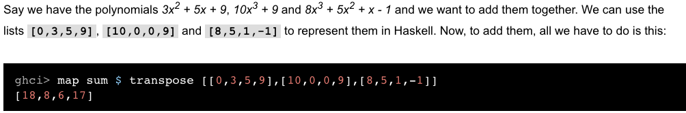

## load module
> import Data.List

> import Data.List (nub, sort)

> import Data.List hiding (nub, sort)

> import qualified Data.List  => Data.List.nub

> import qualified Data.List as L  => L.nub

> in ghci: 

>       > :m + Data.List Data.Map Data.Set

> Transpose:

