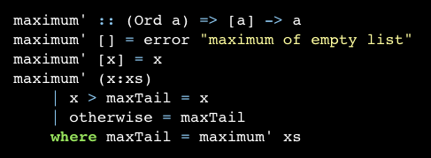
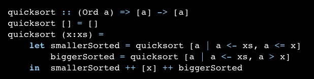

# recursion
```
Recursion is important to Haskell because unlike imperative languages, you do computations in Haskell by declaring what something is instead of declaring how you get it. That's why there are no while loops or for loops in Haskell and instead we many times have to use recursion to declare what something is.
```

``` 
Haskell supports infinite lists, our recursion doesn't really have to have an edge condition. But if it doesn't have it, it will either keep churning at something infinitely or produce an infinite data structure, like an infinite list. The good thing about infinite lists though is that we can [ cut ] them where we want. 
```


