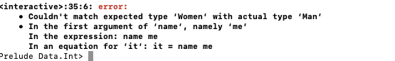

# Type && Type class
## algebraic data type
```
data Bool = False | True 

data Int = -2147483648 | -2147483647 | ... | -1 | 0 | 1 | 2 | ... | 2147483647  

data Shape = Circle Float Float Float | Rectangle Float Float Float Float   
```
***The Circle [value constructor] has three fields, which take floats.***
```
ghci> :t Circle  
Circle :: Float -> Float -> Float -> Shape  

ghci> :t Rectangle  
Rectangle :: Float -> Float -> Float -> Float -> Shape  


surface :: Shape -> Float  
surface (Circle _ _ r) = pi * r ^ 2  
surface (Rectangle x1 y1 x2 y2) = (abs $ x2 - x1) * (abs $ y2 - y1)  

ghci> surface $ Circle 10 20 10  
314.15927  

ghci> surface $ Rectangle 0 0 100 100  
10000.0 
```
***deriving***
```
data Shape = Circle Float Float Float | Rectangle Float Float Float Float deriving (Show)  

ghci> Circle 10 20 5  
Circle 10.0 20.0 5.0  
ghci> Rectangle 50 230 60 90  
Rectangle 50.0 230.0 60.0 90.0  
```

***Value constructors are functions***
> ghci> map (Circle 10 20) [4,5,6,6]  
[Circle 10.0 20.0 4.0,Circle 10.0 20.0 5.0,Circle 10.0 20.0 6.0,Circle 10.0 20.0 6.0]  

```
data Point = Point Float Float deriving (Show)  
data Shape = Circle Point Float | Rectangle Point Point deriving (Show)  

nudge :: Shape -> Float -> Float -> Shape  
nudge (Circle (Point x y) r) a b = Circle (Point (x+a) (y+b)) r  
nudge (Rectangle (Point x1 y1) (Point x2 y2)) a b = Rectangle (Point (x1+a) (y1+b)) (Point (x2+a) (y2+b)) 

ghci> nudge (Circle (Point 34 34) 10) 5 10  
Circle (Point 39.0 44.0) 10.0  

-- auxiliary function 
baseCircle :: Float -> Shape  
baseCircle r = Circle (Point 0 0) r  
  
baseRect :: Float -> Float -> Shape  
baseRect width height = Rectangle (Point 0 0) (Point width height)  

ghci> nudge (baseRect 40 100) 60 23  
Rectangle (Point 60.0 23.0) (Point 100.0 123.0)  
```
***export your type***
```
module Shapes
( Point(..)     //export all the value constructors 
, Shape(
    Rect,Circle // specify the value constructors that you want to export for it
),
Other(),        //export nothing
, surface
, nudge
, baseCircle    //auxiliary function 
, baseRect
) where
```
> Not exporting the value constructors of a data types makes them more abstract in such a way that we hide their implementation. Also, whoever uses our module can't pattern match against the value constructors.

## Record Syntax

```
data Person = Person {    firstName :: String
                        , lastName :: String
                        , age :: Int
                        , height :: Float
                        , phoneNumber :: String
                        , flavor :: String
                     } deriving (Show)
```
> So instead of just naming the field types one after another and separating them with spaces, we use curly brackets. First we write
the name of the field, for instance, firstName and then we write a double colon :: (also called Paamayim Nekudotayim,
haha) and then we specify the type. The resulting data type is exactly the same. The main benefit of this is that it creates
functions that lookup fields in the data type. By using record syntax to create this data type, Haskell automatically made these
functions: firstName , lastName , age , height , phoneNumber and flavor .

```
ghci> :t flavor
flavor :: Person -> String

ghci> :t firstName
firstName :: Person -> String
```
***but what if we have name collision with the automatically created name ,like firstName from different type ??????***
> it will be the newly created name




```
data Car = Car {company :: String, model :: String, year :: Int} deriving (Show)

ghci> Car {company="Ford", model="Mustang", year=1967}
Car {company = "Ford", model = "Mustang", year = 1967}
```
> When making a new car, we don't have to necessarily put the fields in the proper order, as long as we list all of them. But if we
don't use record syntax, we have to specify them in order.


# Type parameter
```
data Vector a = Vector a a a deriving (Show)  
  
vplus :: (Num t) => Vector t -> Vector t -> Vector t  
(Vector i j k) `vplus` (Vector l m n) = Vector (i+l) (j+m) (k+n) 

ghci> Vector 3 5 8 `vplus` Vector 9 2 8  
Vector 12 7 16  

ghci> Vector 3 5 8 `vplus` Vector 9 2 8 `vplus` Vector 0 2 3  
Vector 12 9 19  
```

>  it's very important to distinguish between the type constructor and the value constructor. When declaring a data type, the part before the = is the type constructor and the constructors after it (possibly separated by |'s) are value constructors. Giving a function a type of Vector t t t -> Vector t t t -> t would be wrong, because we have to put types in type declaration and the vector type constructor takes only one parameter, whereas the value constructor takes three. Let's play around with our vectors.